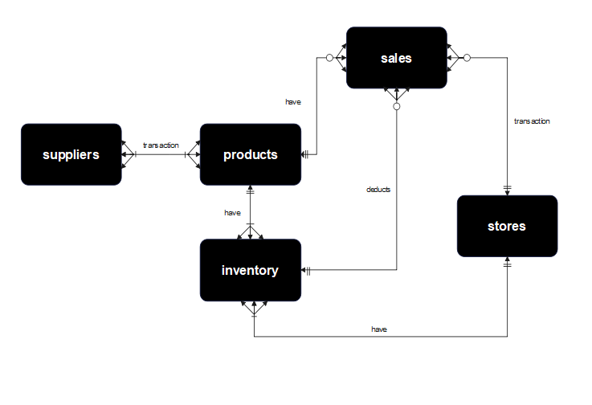

# Design Document

Title: Meñez Corporation Database System
Presented by: Avim Dave Meñez
GitHub: tacs20
edX: avimdmenez
Location: Cebu City, Philippines
Date: 02-13-2024

Video overview: <(https://youtu.be/T-E7pw1RMHk)>

## Scope

The meñez corporation database system comprises vital components essential for facilitating, tracking, and organizing operations across various store-branches, supply-chain, and inventory management. As such, the database's scope encompasses the following:

* Products, includes basic identification, and where can it be procured
* Sales transactions, including basic information at which the transaction was made, the quantity, and product that was sold, also the date and branch where the transaction had occured
* Supplier, including basic identifying information
* Inventory, which includes the basic information of current quantity of assets in each store of a specified location
* Stores, which includes basic identification, address/location of each branches.

Out of scope elements like taxes, all costs related to operation, variable costs, in-depth return of investment calculation(ROI), weather conditions affecting product's supply and demand, invoices, vouchers, discounts and other attributes that are not limited to the current data set.

## Functional Requirements

This data base will support

* CRUD operations for data analysts
* Sales transactions forcasting, to analyze the business condition involving store branches.
* Inventory to sales tracking to ensure that the product is available through different channels prior to demand.
* Update and revert mechanism on tables

Note that the current system will not support customer feedback. Customer requests, and claims shall be conducted personally on stores/branches.

## Representation

Entities are captured in SQLite tables with the following schema.

### Entities
The database includes the following entities:

### products
The `products` table includes;
* `id`, at which specifies the unique ID for the product as an `INTEGER`. This column thus has the `PPRIMARY KEY` constraint applied.
* `name`, which specifies the product's name as `TEXT`, given `TEXT` is appropriate for name fields.
* `supplier_id`, which specifies the ID of the supplier on which the product was procured was writted as an `INTEGER`. This column thus has the `FOREIGN KEY` constraint applied, referencing the `id` column in the `suppliers` table, which ensures that each product be referenced back to supplier.
* `cost`, which contains the cost of each product as `NUMERIC`. depending on the actual costs, this column can either store either floats or integers. A `CHECK` Constraint also ensures that the cost is greater than 0.

All columns are required and hence have the `NOT NULL` constraint applied where a `PRIMARY KEY` or `FOREIGN KEY` constraint is not. The `cost` column has an additional constraint to check if its value is greater than 0, given that this is the valid for every price of the product.

### suppliers
The `suppliers` table includes:
* `id`, which specifies the unique ID for the supplier as an `INTEGER`. This column thus has the `PRIMARY KEY` constraint applied.
* `name`, which specifies the name of the supplier as `TEXT`
* `contact_info`, which specifies the contact information of the supplier as `TEXT`.

All columns in the `suppliers` table are required and hence should have the `NOT NULL` constraint applied.

### stores
The stores table includes:

* `id`, which specifies the unique ID for the store as an `INTEGER`. This column thus has the `PRIMARY KEY` constraint applied.
* `name`, which specifies the name of the store as `TEXT`.
* `address`, which specifies the address of the store as `TEXT`.
* `neighborhood`, which specifies the neighborhood of the store as `TEXT`.

All columns in the `stores` table are required and hence should have the `NOT NULL` constraint applied.

### inventory
The `inventory` table includes:

* `id`, which specifies the unique ID for the inventory as an `INTEGER`. This column thus has the `PRIMARY KEY` constraint applied.
* `product_id`, which specifies the ID of the product in the inventory as an `INTEGER`. This column thus has the `FOREIGN KEY` constraint applied which establishes a foreign key constraint referencing the `id` column in the `products` table to ensure data integrity.
* `store_id`, which specifies the ID of the store where the product is located as an `INTEGER`. This column thus has the `FOREIGN KEY ` which establishes a foreign key constraint referencing the `id` column in the `stores` table to ensure data integrity.
* `quantity_available`, which specifies the quantity of the product available as an `INTEGER`. This correlates to every store on which a sale might occur. It is specified that every sale transaction has a direct effect on the quantity of products in the `inventory` as such, a sale may trigger deduction on the current assets held. In addition, a `CHECK` constraint was applied to this column to ensure that the amount will be always be a non-negative number (equal or greater than zero). As such, if a product quantity will reach zero, it will revert all transactions pertaining to all possible incoming transactions that is related to the said product until it regains its quantity.

All columns in the `stores` table are either `PRIMARY KEY` or `FOREIGN KEYS`, of which by principle are automatically `NOT NULL`, hence, all columns doesn't need a `NOT NULL` constraint. The `quantity_available` column has an additional constraint to check if its value is greater or equal to zero to ensure data integrity.

### Sales
The `sales` table includes:

*  `id`, which specifies the unique ID for the sale as an `INTEGER`. This column thus has the `PRIMARY KEY` constraint applied.
* `store_id`, which specifies the ID of the store where the sale occurred as an `INTEGER`. This column thus has the `FOREIGN KEY ` which establishes a foreign key constraint referencing the `id` column in the `stores` table to ensure data integrity.
* `product_id`, which specifies the ID of the product sold as an INT. This column thus has the `FOREIGN KEY ` which establishes a foreign key constraint referencing the `id` column in the `products` table to ensure data integrity.
* `date`, which specifies the date of the sale as a `DATE` and additional constraint `DEFAULT` to current date.
* `unit_price`, which specifies the unit price of the product sold as a NUMERIC and is NOT NULL.
* `quantity`, which specifies the quantity of the product sold as an INT.
* `total`, which specifies the total price of sale. Calculated as (`total` = `unit_price` * `quantity`) as a `NUMERIC` of which can store both floats and integers.

All columns are required and hence have the `NOT NULL` constraint applied where a `PRIMARY KEY` or `FOREIGN KEY` constraint is not. The `date` column has an additional constraint `DEFAULT (date('now'))` to ensure current date is applied.

### Relationships

he below entity relationship diagram describes the relationships among the entities in the database.

* one or many supplier are capable to deliver one to many products, one, if they are only required to deliber one, and many of they are in bulk buy of different products. A product is made by one or many suppliers. It is designed if the product is not available on one supplier it can be procured on other many suppliers
* one or many products can be present in the inventory, one if only one store has that product, and many store can have that product in their inventory. Inventory can only represent one store and one product.
0 to many product can represent in sales table. 0, if no product is sold, many if a product was sold repeatedly. (any sale transaction can only affect a single product, if a customer wants to purchase different product, it will be charged as another single sale transaction. only then the price will add up for that specific customer who made a multiple purchase of multiple products).
* one and only one inventory can represent for each product and each store.
* one or many stores are capable to store multiple products in their inventory. As such, each product is represented as inventory at a quantity.
one, if only one store has that inventory (product). Many, if a store has multiple inventory of products. 0 or many store can create a sale transaction. 0, if no sale transaction was created by that store. Many, if multiple transactions was created by that store.
* per sale transaction can only affect one, and only one product, store, and inventory. As such, when a transaction was conducted a sale only represents one product, one inventory, and one store.
when a sale is conducted, the quantity of a specific product_id is automatically deducted on the inventory, given that the inventory is != 0.
if by chance that the sale is conducted and the inventory for that product is = 0, the transaction will be aborted with message 'Insufficient quantity available in inventory'.

## Optimizations

Queries to be conducted in `queries.sql` varies as to which data is needed for the particular event. In this case, all queries in `queries.sql` are one for of example on how to manipulate this database to extract, load, and transform appropriate data needed to perform actionable insights.
Thus, basic types of indexes are made to help out various types of possible queries to be performed at a bare minimum.

Indexes made are: `name`, and `cost` columns for `products` table.
                  `product_id` and `quantity_available` for `inventory` table.
                  `id` and `name` for `supplier` table.
                  `id` and `name` for `stores` table.
                  `id`, `store_id` and `product_id` for `sales` table.

## Limitations

The current schema only shows where the products can be procured from, actual transactions from suppliers would need another table and a relatioship of one to many into the `inventory` table.
